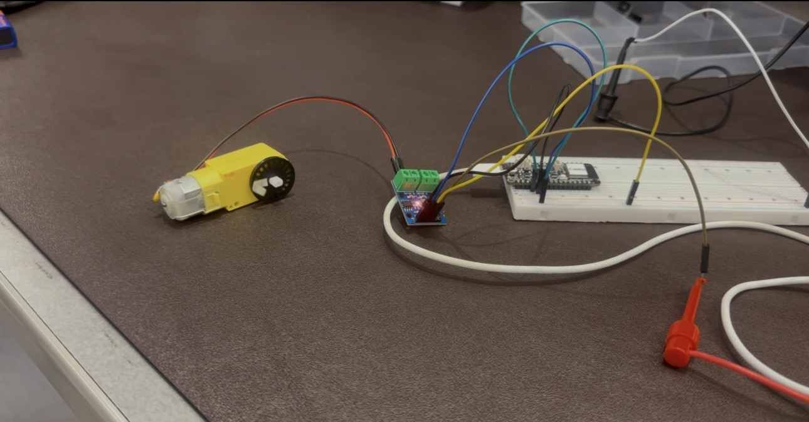
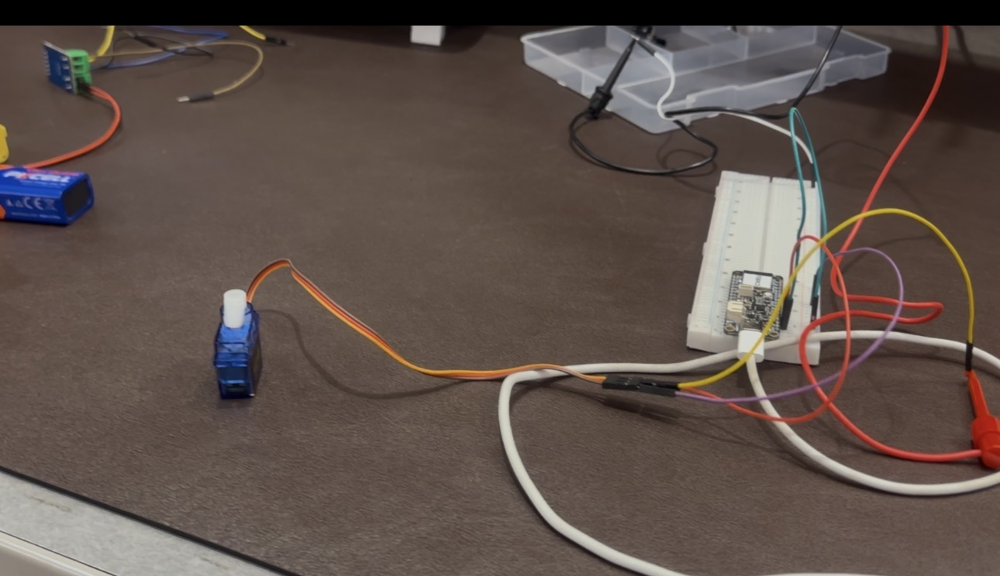

# Lab 4 README | ESP32 and Actuators - Ayan Sheikh

In this lab, we use PlatformIO to connect an Adafruit Feather ESP32 V2 to two different types of actuators: a TT DC gear motor and an SG90 servo motor. This is my third assignment working with the ESP32.

For this lab, I used a MacBook Pro, a USB-C data-capable cable, VS Code, and PlatformIO to write and upload code to the ESP32. The TT motor was connected through an L9110 motor driver, while the servo motor was connected to the ESP32 for its control signal and powered using the lab DC power supply.

The purpose of this lab was to experiment with controlling motor direction, speed, timing, servo position, PWM frequency, pulse width, and movement patterns.

## Repository Layout

The `src` folder contains the C++ programs used to control the TT motor and servo motor.

```text
Lab 4/
├── src/
│   ├── TT Motor Rotate.cpp
│   ├── Servo Motor.cpp
│   └── Servo Motor Random.cpp
│
├── platformio.ini
│
└── actuator adventures.md
```

- `TT Motor Rotate.cpp` controls the TT motor so that it rotates clockwise for 5 seconds, stops for 2 seconds, rotates counterclockwise for 5 seconds, and stops again for 2 seconds before repeating.
- `Servo Motor.cpp` moves the servo through a defined angular range and was used to experiment with pulse width, PWM frequency, rotation range, and delay.
- `Servo Motor Random.cpp` moves the servo to randomly generated positions between 0° and 180°.
- `platformio.ini` contains the PlatformIO configuration used to build and upload the programs to the ESP32.
- `actuator adventures.md` contains the documentation, observations, pictures, and reflection for Lab 4.

## Setup and Preparation

### Tools and Hardware Used

- MacBook Pro
- VS Code
- PlatformIO
- USB-C data-capable cable
- Adafruit Feather ESP32 V2
- Breadboard
- Jumper wires
- TT DC gear motor
- L9110 motor driver
- SG90 servo motor
- HY3005F DC power supply

## Part 1: TT Motor

### Circuit Setup

For the TT motor portion of the lab, the ESP32 was connected to an L9110 motor driver using a breadboard and jumper wires. The TT motor was then connected to the motor driver.

The benchtop DC power supply was limited to:

- **Voltage:** 3 V
- **Current:** 0.15 A

The motor driver was used between the ESP32 and TT motor so that the ESP32 control signals could determine the direction and operation of the motor.

### TT Motor Circuit


### TT Motor Rotation Program

I modified `TT Motor Rotate.cpp` so that the TT motor follows this sequence:

1. Rotate clockwise for 5 seconds.
2. Stop for 2 seconds.
3. Rotate counterclockwise for 5 seconds.
4. Stop for 2 seconds.
5. Repeat the sequence.

The ESP32 uses GPIO pins **26** and **25** to control the two motor-driver inputs.

To rotate the motor clockwise, one motor driver input is set HIGH while the other is set LOW.

To stop the motor, both inputs are set LOW.

To rotate the motor counterclockwise, the signals are reversed.

The motor is then stopped again for two seconds before the loop repeats.

## Part 2: Servo Motor

### Circuit Setup

For the servo portion of the lab, the SG90 servo motor was connected to the ESP32 using a breadboard and jumper wires.

The benchtop DC power supply was limited to:

- **Voltage:** 5 V
- **Current:** 0.75 A

The servo's signal wire was connected to ESP32 GPIO pin **26 / A0**.

### Servo Motor Circuit


## Servo Motor Parameter Testing

### Minimum Pulse Width

The initial minimum pulse width was 500

I experimented with reducing the minimum pulse width. Changing the lower pulse-width limit affected the servo's endpoint behavior and available rotation.

### Maximum Pulse Width

The initial maximum pulse width was 2500

Increasing or decreasing the maximum pulse width changed the range through which the servo attempted to rotate.

I observed that increasing the difference between the minimum and maximum pulse widths generally increased the servo's available rotation range.

### PWM Frequency

The standard PWM frequency used by the servo was 50 Hz

At the standard **50 Hz**, the servo operated normally.

I also experimented with different PWM frequencies.

At a much higher frequency, such as 750 Hz

the servo produced shorter, faster pulses with less useful rotation.

At a lower frequency, such as 10Hz


the servo movement became slower and choppier, with more noticeable pauses.

### Rotation Range

The original servo program was designed to operate over a larger angular range.

I changed the rotation range so that the servo moved between approximately **0° and 90°**.


The servo was then moved back from 90° toward 0°.


Reducing the maximum angle caused the servo to move through a shorter physical rotation.

### Delay

The servo code used:

20 ms delay

The delay determines how much time passes before the servo moves to the next commanded angle.

Increasing the delay made the servo sweep more slowly because more time passed between each position update.

Decreasing the delay made the servo move through the sweep more quickly.


## Uploading the Code

I used **PlatformIO in VS Code** to compile and upload the C++ programs to the ESP32.

### Upload Process

1. Connect the ESP32 to the MacBook Pro using a USB-C data-capable cable.
2. Open the Lab 4 PlatformIO project in VS Code.
3. Make sure the correct ESP32 environment is selected in `platformio.ini`.
4. Connect the appropriate TT motor or servo circuit following the circuit diagram.
5. Enable the program that I want to test(comment out other setup() and loop()).
6. Build the project using PlatformIO.
7. Upload the compiled program to the ESP32 over USB-C.
8. Observe the actuator behavior.
9. Change one parameter at a time.
10. Rebuild and upload the program after each modification.
11. Record the resulting behavior in this Markdown file.

Because multiple `.cpp` files contain their own `setup()` and `loop()` functions, only the program being tested should have its `setup()` and `loop()` functions active.

The other programs can be commented out using:


/*
    Code that should not currently be compiled
*/


This prevents multiple definitions of `setup()` and `loop()` from being compiled into the same PlatformIO project.

## Results

Both the TT motor and servo motor were successfully controlled using the ESP32.

The TT motor demonstrated how motor-driver control signals can be used to control continuous clockwise and counterclockwise rotation.

Setting the two motor-driver inputs to opposite logic values caused the TT motor to rotate:

```text
HIGH / LOW  -> One direction
LOW / HIGH  -> Opposite direction
LOW / LOW   -> Motor stopped
```

The servo demonstrated how PWM pulse widths can be used to command angular positions.

The primary difference between the two motors is that the TT motor is designed primarily for continuous rotation, while the servo is designed to move to and hold specific angular positions.

The TT motor uses a motor driver (L9110) to control its direction and operation, while the servo uses PWM signals with specific pulse widths to determine its position.

## Time Reporting and Reflection

### 1. How long did it take you to complete this assignment?

- Like 1.5 hours

### 2. What level of difficulty would you associate with this assignment?

- [ ] Low
- [x] Medium
- [ ] High

### 3. If you associated medium/high difficulty with this assignment, what aspect did you find the most difficult?

- Unclear instructions

### 4. How comfortable do you currently feel with the course content?

- Comfortable. The workload is a little heavy, but the material itself has not been particularly difficult.

### 5. Do you have any additional information or feedback you would like to share with the instructors?

- Shorter labs or more lab time during the week