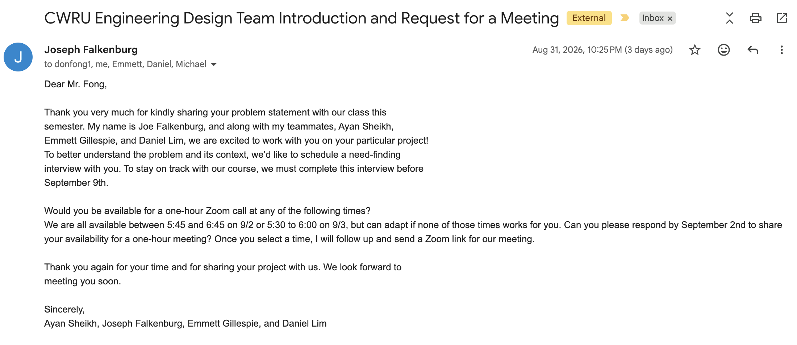

# ECSE Week 1 Project Log

## 8/24 Attended Lecture 1

- Learned course outline and structure

## 8/25 Received Team Assignment

- Grouped with members 
  - Joseph Falkenburg 
   - Emmett Gillespie
  - Daniel Lim

## 8/26 Ranked Stakeholder Problem Statement & Completed Lab Safety Quiz
- Our ranking
  1. **Birdfeeder** - "I need a bird feeder that will only dispense food for birds and not deer."
  2. **Cat** - "I need to keep my cat entertained while I'm at work."
  3. **Toilet Seat** - "I forget to close the toilet cover before flushing."
  4. **Machine washer/dryer** - "I always forget clothes in the washing machine/dryer"
  5. **Window** - "I forget to close the windows before leaving for work"

## 8/27 Received Stakeholder Assignment
- Our team received our #1 choice Don Fong [Birdfeeder]
- I drafted the email with all availible details (scored 6/10 with one retry attempt)
- Our team email stakeholder on 8/31 after scoring 10/10

## 8/28 Completed ECSE Lab1 GitHub and Markdown Basic
- Emmett Completed the Stakeholder email with everyones availibility (except for Josephs)
- I worked on lab1_overview.md and Week1.md files to complete the lab

